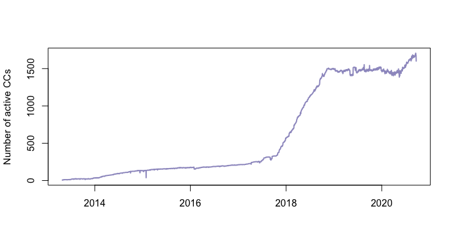
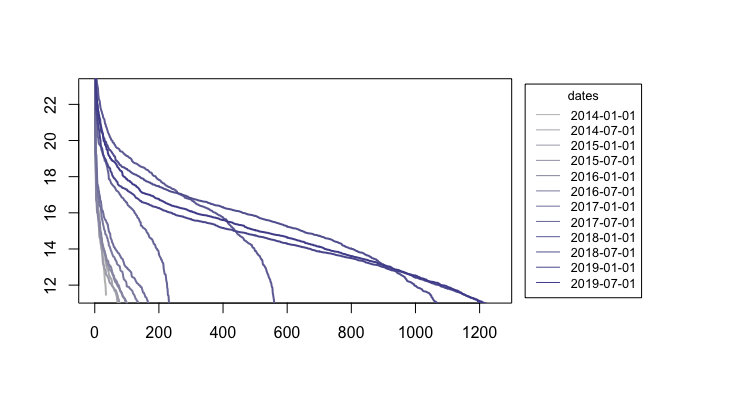

[](http://quantlet.de/)

## [](http://quantlet.de/) **SVCJrw_CC_market_caps** [](http://quantlet.de/)

```yaml

Name of QuantLet : 'SVCJrw_CC_market_caps'


Published in : 'SVCJrw' 


Description : 'This Quantlet  1) computes the number of active cryptocurrencies (CCs with a market capitalization greater than Zero and 2) depicts the market capitalization of all CCs in decreasing order and for selected dates (every 6m).'


Keywords : 'Cryptocurrencies, market capitalization, active coins, price'


Author : 'Konstantin Häusler'

```





### R Code
```r

#############################
# Evolution of the CC market#
#############################
library("viridis") 
library(RColorBrewer)
display.brewer.all()
colors <- brewer.pal(11, "Spectral")
colors2 <- heat.colors(11)
colors3 <- magma(11)
colors4 <- rev(colors3)
colors5= colorRampPalette(c("grey", "navy"))(20)

#####################
#Graph of Active CCs#
#####################

#read data
cd.09 <- read.csv("/Users/konstantin/Desktop/dateien/IRTG 1792/CoinGecko/20201001/test.csv")

#data manipulations
remove_empty_rows <- function(x){
  x <- x[x$prices >0 & x$total_volumes >0 & x$market_caps >0,] 
  x
}
cd.09 <- remove_empty_rows(cd.09)

transform_date <- function(x){
  x$Datetime <- as.character(x$Datetime)
  x$Datetime <- factor(x$Datetime)
  x
}
cd.09 <- transform_date(cd.09)

#compute the number of active coins for each date
number_active_coins <- function(x){
  w <- NULL
  for (i in levels(x$Datetime)) {
    tmp.w <- nrow(x[x$Datetime == as.character(i),])
    w <- rbind(w, tmp.w)
  }
  w
}
w <- number_active_coins(cd.09)

#prepare data
w <- as.data.frame(w)
rownames(w) <- levels(cd.09$Datetime)
colnames(w) <- "number_of_coins"
w$Date <- levels(cd.09$Datetime)
w$Date <- as.Date(w$Date)

#plot

plot(w$number_of_coins~w$Date, 
     type = "l" , 
     ylab = "Number of active CCs", 
     xlab= "", 
     lwd=2,
     col="#9E9AC8")

##########################
#Graph: Market_Cap Curves#
##########################
cd.09$log_mc <- log(cd.09$market_caps)
cd.09$Datetime <- as.Date(cd.09$Datetime)
sel.dates <- data.frame(dates=seq(as.Date("2014-01-01"), as.Date("2019-07-01"), by="6 mon"))
index.table <- data.frame(date = sel.dates$dates, index = seq(1:12))

dev.off()

par(pin = c(4.5,3), 
    mar =par()$mar+ c(0,0,0,3),
   # oma = par()$oma+ c(0,0,0,2),
    xpd=F
    )

plot(sort(cd.09$log_mc[cd.09$Datetime == "2014-01-01"], decreasing = TRUE), 
     type = "l", 
     #xlab="coins ranked by log(MarketCap)", 
     #ylab="log(MarketCap)", 
     col = colors5[1],
     xlab = "",
     ylab = "",
     main = "",
     #ylim = c(0,24),
     xlim = c(0, 1250), lwd=2)

for (datum in sel.dates$dates[-c(1)]) {
  i = index.table[index.table$date == datum,2] 
  lines(sort(cd.09$log_mc[cd.09$Datetime == datum], decreasing = TRUE), col=colors5[i],lwd=2)
}

legend("right",
       legend=sel.dates$dates, 
       col=colors5,
       inset = c(-0.3,0),
       #pch=c(19), pt.cex=1, 
       #bg='lightgrey',
       xpd=TRUE,
       cex = 0.8,
       lty = 1,
       #text.col = c("black", colors),
       title="dates")


```

automatically created on 2021-01-26